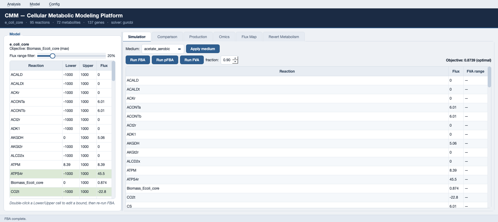
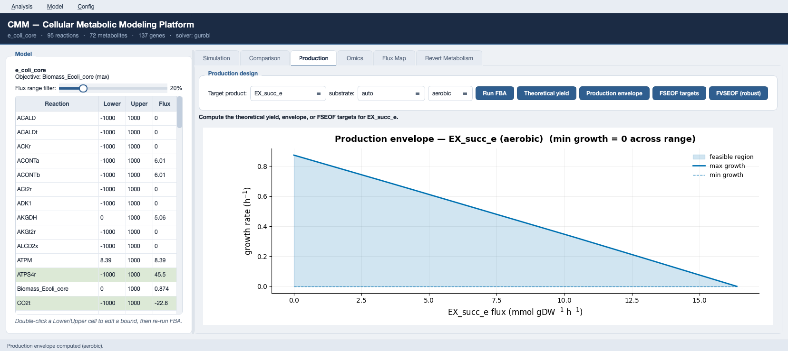
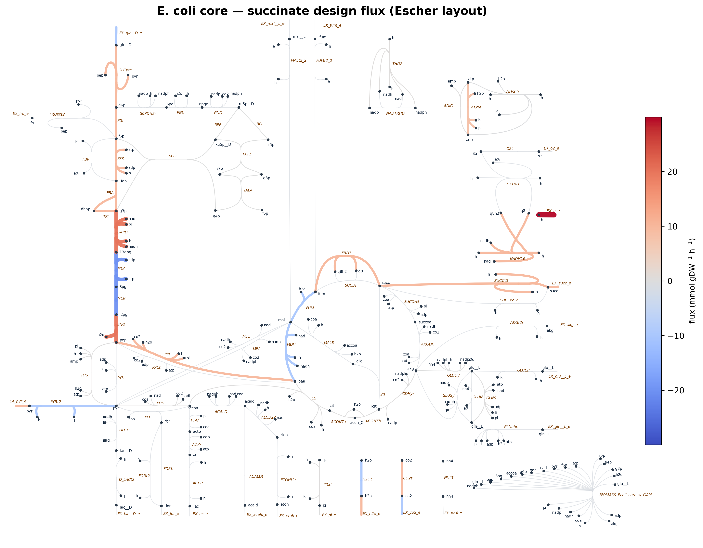
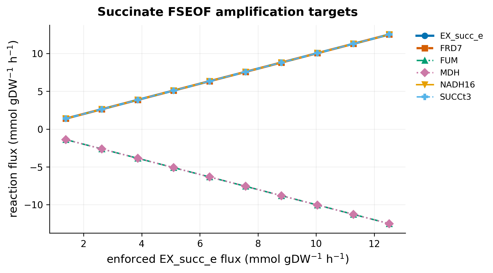
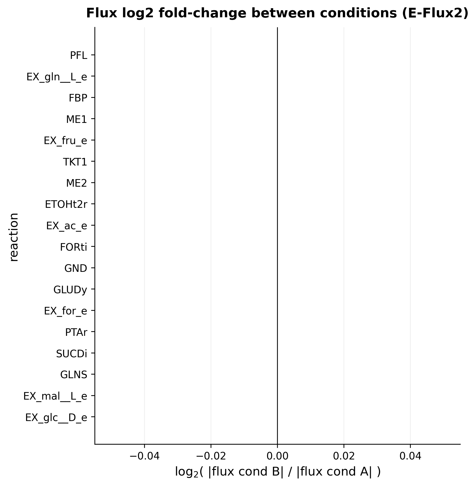

# CMM — Cellular Metabolic Modeling Platform

[](https://github.com/jyryu3161/CMM/actions/workflows/ci.yml)

CMM is a desktop platform and Python library for genome-scale metabolic modeling: flux
simulation, omics integration, metabolic-engineering design, and publication-quality
visualization. It is built on [COBRApy](https://opencobra.github.io/cobrapy/) and runs every
analysis through small, solver-neutral services so the same code powers both the GUI and
scripts.



## Features

- **Simulation** — FBA, parsimonious FBA (pFBA), and FVA.
- **Growth media** — preset media (glucose/acetate/glycerol, aerobic and anaerobic) applied
  with one click; easy reaction-bound editing in the model table.
- **Perturbation response** — MOMA (L1/L2) and ROOM against a reference *template* you choose
  from FBA, pFBA, LAD, or E-Flux2.
- **Omics integration** — single-state expression → flux with **E-Flux2** (Kim 2016) and
  **LAD**; multi-condition prediction with log2 fold-change comparison between conditions.
- **Production design** — theoretical yield (with CO₂-fixation disclosure), production
  envelopes, FSEOF and **FVSEOF** (variability-aware: robustly-forced amplification targets),
  and **OptKnock / RobustKnock** growth-coupled strain designs.
- **Normalization targets** — robust MTA (rMTA) and a MOMA/MTA transformation finder that
  ranks gene knockouts moving flux from one condition toward another.
- **Visualization** — Escher-layout flux maps coloured by flux, plus paper-ready production
  envelopes, FSEOF profiles, and flux comparisons (300 DPI, colour-blind-safe).

## Installation

CMM requires Python ≥ 3.10 and runs on **Windows, macOS, and Linux** — it is pure Python
(no platform-specific build), so one universal wheel installs everywhere. A QP/MILP solver
(Gurobi or CPLEX) is recommended: the open GLPK solver runs FBA/pFBA/FVA, but MOMA, ROOM,
revert-metabolism (QP), OptKnock (MILP), and original-MTA (MIQP) need a QP/MILP/MIQP-capable
solver. `pip install gurobipy` ships a free size-limited license that already covers small
models such as `e_coli_core`.

### Install a release (easiest)

Each tagged version is published as a [GitHub Release](https://github.com/jyryu3161/CMM/releases)
with a prebuilt wheel attached. Install it — with optional extras — on any OS:

```bash
# from a release wheel (replace the version)
pip install "cmm[desktop,design] @ https://github.com/jyryu3161/CMM/releases/download/v0.2.0/cmm-0.2.0-py3-none-any.whl"

# or straight from the repository at a tag (or @main for the latest)
pip install "cmm[desktop,design] @ git+https://github.com/jyryu3161/CMM.git@v0.2.0"
```

### Install from source with one command

Clone the repository and run the installer — it creates an isolated virtual environment
(`./.venv`), installs CMM (editable) with the desktop GUI, strain design, and the `gurobipy`
solver, and prints the active solver:

```bash
git clone https://github.com/jyryu3161/CMM.git && cd CMM

./install.sh                # macOS / Linux (and Windows Git Bash / WSL)
#   .\install.ps1           # Windows PowerShell

# then launch the platform:
.venv/bin/python -m cmm.app          # Windows: .venv\Scripts\python -m cmm.app
```

Useful flags (same names on `install.ps1` as `-Dev`, `-NoGurobi`, `-CoreOnly`):

```bash
./install.sh --dev          # also install tests + ruff
./install.sh --no-gurobi    # open GLPK only (FBA/pFBA/FVA/FSEOF)
./install.sh --core-only    # core library, no GUI / strain-design extras
./install.sh --help         # all options (--python, --venv, ...)
```

### Install from source manually

```bash
git clone https://github.com/jyryu3161/CMM.git && cd CMM

python -m pip install -e .                     # core library
python -m pip install -e ".[desktop,design]"   # desktop GUI (Qt + matplotlib) + strain design
python -m pip install -e ".[dev]"              # tests + ruff
```

Launch the GUI:

```bash
python -m cmm.app
```

The Config menu reports the active solver and warns when it cannot run the full toolkit.

### Releasing (maintainers)

Pushing a `v*` tag triggers `.github/workflows/release.yml`, which builds the sdist + wheel and
attaches them to a new GitHub Release. Every push and PR is validated by
`.github/workflows/ci.yml` (ruff + the full test suite on Ubuntu, Windows, and macOS).

```bash
git tag v0.2.0 && git push origin v0.2.0
```

## Quick start (Python API)

```python
from cobra.io import load_model
from cmm.core import fba, pfba, apply_medium
from cmm.features import theoretical_yield, optknock

model = load_model("textbook")          # e_coli_core

apply_medium(model, "glucose_aerobic")  # preset medium
print(fba(model).objective_value)       # 0.8739  (growth rate, 1/h)
print(pfba(model).fluxes["Biomass_Ecoli_core"])

# theoretical succinate yield from glucose
y = theoretical_yield(model, "EX_succ_e")
print(f"{y.molar_yield:.3f} mol/mol {y.substrate}")   # 1.638 (aerobic)

# growth-coupled succinate knockout design
designs = optknock(model, "EX_succ_e", max_knockouts=3)
print(designs.best().knockouts)
```

Omics integration and condition comparison:

```python
import pandas as pd
from cmm.omics import predict_condition_fluxes, flux_log_change

expression = pd.read_csv("expression.csv").set_index("gene")  # genes × conditions
fluxes = predict_condition_fluxes(model, expression, method="eflux2")
log_fc = flux_log_change(fluxes.fluxes("condition_A"), fluxes.fluxes("condition_B"))
```

## GUI tutorial

1. **Load a model** — start `python -m cmm.app`; the left panel lists every reaction with
   editable Lower/Upper bounds.
2. **Pick a medium** — on the *Simulation* tab choose a preset medium and click **Apply
   medium**, then **Run FBA** / **Run pFBA**. Edit any bound in the table and re-run.
3. **Compare perturbations** — on the *Comparison* tab pick a reference template
   (FBA/pFBA/LAD/E-Flux2), a reaction to knock out, and MOMA or ROOM.
4. **Design for a product** — on the *Production* tab compute theoretical yield, a production
   envelope, or FSEOF amplification targets for a target exchange.
5. **Integrate omics** — on the *Omics* tab load an expression CSV/TSV and run E-Flux2 or LAD.
6. **Rank normalization targets** — on the *Revert Metabolism* tab load source and target
   expression CSV/TSV files, then run rMTA/MTA to rank candidate gene or reaction knockouts.
7. **Visualize** — the *Flux Map* tab renders an Escher-layout map coloured by the current
   flux distribution.

| Production envelope | Escher flux map |
|---|---|
|  |  |

| FSEOF targets | Multi-condition log-change |
|---|---|
|  |  |

## Correctness

Every platform service is validated against direct COBRApy computations on `e_coli_core`
(see `tests/test_validation.py`): FBA, pFBA, FVA, MOMA, theoretical yield, and media all match
the cobra reference to numerical tolerance, so GUI results equal scripted results.

```bash
python -m pytest          # full test suite
```

## License

Proprietary. See the project owner for terms.
