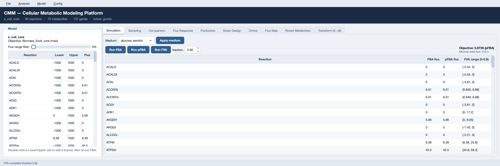

# CMM — Cellular Metabolic Modeling Platform

[](https://github.com/jyryu3161/CMM/actions/workflows/ci.yml)

CMM is a Python library and Qt desktop application for constraint-based metabolic modeling.
The same solver-neutral services power scripts and the GUI: FBA/pFBA/FVA, omics integration,
perturbation response, production scans, growth-coupled strain design, MTA/rMTA target
ranking, and publication figures.



## Availability and implementation

Source code, documentation, test data, and reproducibility workflows are freely available
at <https://github.com/jyryu3161/CMM> under the [MIT License](LICENSE). CMM is implemented in
Python and supports Python 3.10–3.12 on Linux, macOS, and Windows. It provides both a Python
API and a Qt desktop interface; installation and a complete test run require no registration.
Tagged releases and their test data will remain available for at least two years after
publication, with issue reporting through the repository's
[GitHub Issues](https://github.com/jyryu3161/CMM/issues).

Before journal submission, the exact `v0.4.0` release must additionally be archived in
Zenodo or an equivalent long-term repository and its DOI added to this section,
`CITATION.cff`, and the manuscript's Availability and Implementation statement.

## Implemented methods

- Simulation: FBA, pFBA, FVA, editable conditions, and growth-media presets.
- Perturbations: reaction/gene/multiple knockouts, L1/L2 MOMA, ROOM with both published
  tolerance pairs, and batch screens. The reported distance is a distance — Segrè et al.
  Eq. (4)'s Euclidean value for L2 MOMA — kept separate from the raw solver objective.
- Omics: LAD, strict two-stage E-Flux2, multi-condition flux prediction, and log2 changes.
- Production: theoretical yield with carbon/CO₂ disclosure (media presets close CO₂ *uptake*
  by default; secretion stays free, and the fraction of product carbon supplied by any residual
  CO₂ uptake is reported and warned on), production envelopes, FSEOF, and FVA-based FVSEOF
  classifying on Park et al.'s nine types, with optional caller-supplied linear flux couplings.
- Response and sampling: flux-response scans reporting the exact LP shadow price and its phase
  boundaries, and seeded random flux sampling both uniform and constrained around a reference
  flux state.
- Strain design: distinct OptKnock and three-level RobustKnock modules through StrainDesign,
  followed by independent maximum/guaranteed-product evaluation.
- Normalization: published MTA MIQP, published rMTA best/MOMA/worst scoring, and an explicitly
  labeled legacy continuous heuristic.
- Auditability: deterministic model fingerprints and solver/package/parameter provenance on
  numerical results.

## Reproducible installation

CMM requires Python 3.10–3.12. The publication environment is locked in `uv.lock`:

```bash
git clone https://github.com/jyryu3161/CMM.git
cd CMM
uv sync --frozen --all-extras
uv run python -m cmm.app
```

For a conventional editable installation:

```bash
python -m pip install -e ".[desktop,design,solver-gurobi]"
python -m cmm.app
```

The cross-platform installers create `.venv` and install the desktop, strain-design, and
Gurobi extras by default:

```bash
./install.sh                 # macOS / Linux / WSL
# .\install.ps1             # Windows PowerShell
./install.sh --dev           # also install test, coverage, lint, and type-check tools
./install.sh --no-gurobi     # GLPK LP/MILP only
```

Tagged wheels and source archives are published on the
[GitHub Releases page](https://github.com/jyryu3161/CMM/releases). The current source version
is 0.4.0, a **breaking** release — see `CHANGELOG.md`.

## Solver requirements

Solver capability is checked before a solve; a method never silently changes formulation.

| Class | Methods |
|---|---|
| LP | FBA, pFBA, FVA, LAD, yield, envelope, FSEOF, FVSEOF, flux response, flux sampling |
| MILP | ROOM, OptKnock, RobustKnock |
| QP | L2 MOMA, E-Flux2, `rmta_continuous` |
| MIQP | published MTA and rMTA |

GLPK supports LP/MILP. Gurobi and CPLEX support the full table, subject to their licenses and
model-size limits. The restricted Gurobi license bundled with `pip install gurobipy` is limited
to 2000 variables and 2000 constraints, dropping to **200 variables for any model containing
quadratic terms** — the cap counts variables, not quadratic terms. Because a COBRA LP uses
about two variables per reaction, that restricted license covers CMM's QP/MIQP *validation*
models (all ≤190 variables) but only permits QP/MIQP on networks of roughly **100 reactions or
fewer** — and fewer still for L2 MOMA, which adds one variable per reaction: **L2 MOMA on
`e_coli_core` is 286 variables and already fails** under the restricted license, though it is
neither genome-scale nor mixed-integer. Genome-scale work of any kind, including plain FBA on
iJO1366 (5166 variables), requires a full academic or commercial license.

The `rmta_continuous` QP row above is **unverified**: the test suite has no test that solves its
QP, only a GLPK capability-gate test. See [Known limits](docs/VALIDATION.md).

## Python quick start

```python
from cobra.io import load_model
from cmm.core import apply_medium, fba, pfba
from cmm.features import fseof, theoretical_yield

model = load_model("textbook")
apply_medium(model, "glucose_anaerobic")     # the condition, set once

growth = fba(model)
minimal = pfba(model)
yield_result = theoretical_yield(model, "EX_succ_e")
scan = fseof(model, "EX_succ_e", n_steps=10)

print(growth.objective_value, minimal.status)
print(yield_result.molar_yield, yield_result.metadata["model_sha256"])
print(scan.amplification_targets())
```

Verifying a predicted target — does forcing flux through it actually buy product, and is the
prediction forced or just one of many optima?

```python
from cmm.features import flux_response, random_flux_sampling

response = flux_response(model, "PGI", "EX_succ_e", biomass_fraction=0.3)
print(response.optimum(), response.limit.found, response.feasible_range())

ensemble = random_flux_sampling(model, n=1000, seed=0)
print(ensemble.statistics().loc["EX_succ_e"])
```

Expression integration:

```python
import pandas as pd
from cmm.omics import flux_log_change, predict_condition_fluxes

expression = pd.read_csv("expression.csv").set_index("gene")
predicted = predict_condition_fluxes(model, expression, method="eflux2")
change = flux_log_change(
    predicted.fluxes("condition_A"),
    predicted.fluxes("condition_B"),
)
```

## Validation

The suite includes direct COBRApy cross-checks, a non-optional iJO1366 genome-scale test,
the official COBRA Toolbox MTA test topology, E-Flux2's independent two-stage QP, target
sensitivity checks, offscreen GUI workflows, static analysis, coverage, and distribution
build verification.

```bash
uv sync --frozen --all-extras
QT_QPA_PLATFORM=offscreen uv run pytest -q -ra --strict-markers \
  --durations=10 --cov=cmm --cov-branch --cov-report=term-missing --cov-fail-under=80
uv run ruff check src tests
uv run ruff format --check src tests
uv run mypy src/cmm/core src/cmm/features src/cmm/omics
uvx --from cffconvert==2.0.0 cffconvert --validate
uv build && uvx twine check dist/*
```

The exact evidence, method contracts, references, provenance schema, and limitations are in
[Scientific validation and reproducibility](docs/VALIDATION.md). Passing these checks
supports implementation correctness; it does not constitute wet-lab validation of a new
biological prediction.

## Documentation

- [Desktop and Python tutorial](docs/TUTORIAL.md)
- [Scientific validation and reproducibility](docs/VALIDATION.md)
- [MTA/rMTA design and equations](docs/design-revert-metabolism.md)
- [Architecture and solver contracts](docs/architecture.md)
- [Scenario figures](docs/scenario-figures.md) — what each GUI capture shows, and how to regenerate them
- [Release changes](CHANGELOG.md)

For driving CMM from an AI coding CLI (Claude Code, Codex, …):

- [Agent operating instructions](AGENTS.md) — the scenario router, solver gate, and run contract
- [Metabolic-engineering scenarios](docs/scenarios/README.md) — step-by-step pipelines
- [Function reference for agents](docs/agent-reference.md) — signatures and result objects

## Citation and license

CMM is open source under the [MIT License](LICENSE). Citation metadata are machine-readable
in [CITATION.cff](CITATION.cff); replace the contributor placeholder with the final manuscript
authors and add the archived release DOI before submission. A manuscript should also cite the
original papers for every method it uses, listed in `docs/VALIDATION.md`.

Three points that are easy to get wrong, all detailed there:

- **OptKnock and RobustKnock need three citations, not two** — Burgard et al. (2003) and
  Tepper & Shlomi (2010) for the formulations, *and* Schneider et al. (2022) for the
  `straindesign` package that actually solves them, which carries no citation of its own.
- **`transformation_targets` is not a CMM invention**; both of its paths map to published
  Yizhak et al. (2013) methods and should be cited to that paper.
- **`flux_log_change` has no published source.** It is a CMM utility and must not be cited to
  any paper. CMM's FSEOF selection rule and FVSEOF's `robust_targets()` flag are likewise
  CMM's own and must not be attributed to Choi et al. or Park et al.

## Release process

Every push and pull request installs the frozen lockfile and runs the cross-platform quality
gates. A tag must exactly match `pyproject.toml`; the release workflow reruns all checks,
builds the wheel and sdist, validates them, installs the wheel in a clean environment, and
then attaches the artifacts to a GitHub Release.

```bash
git tag v0.4.0
git push origin v0.4.0
```
